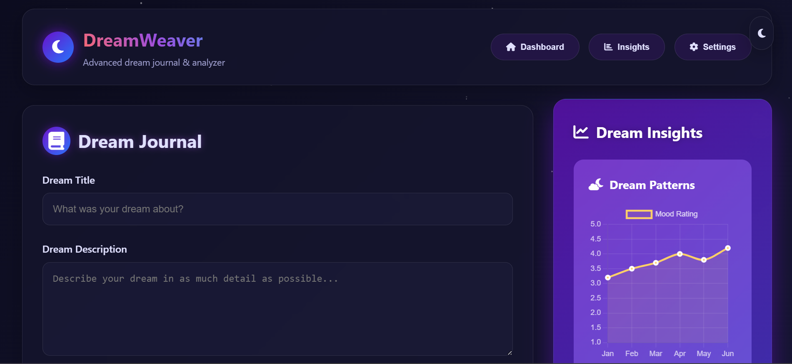
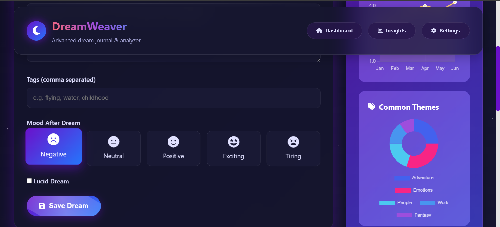
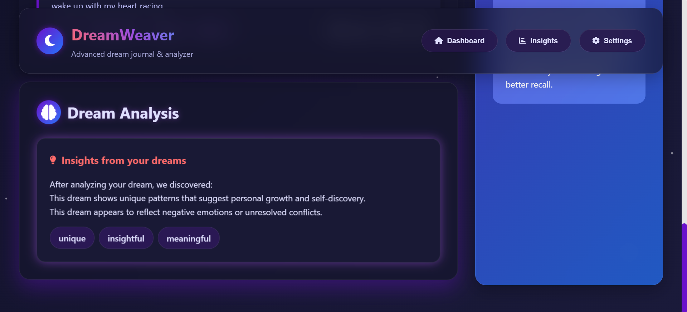
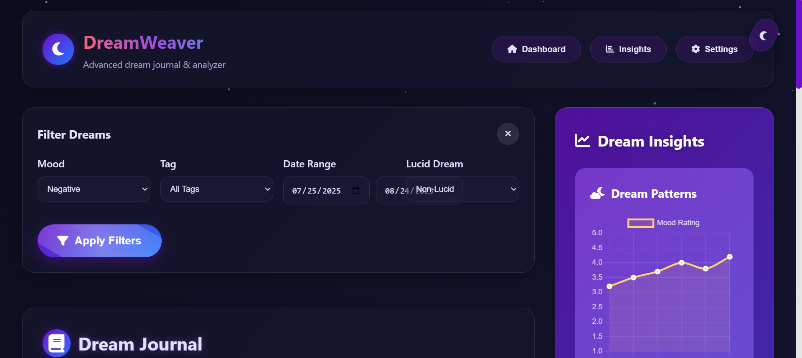
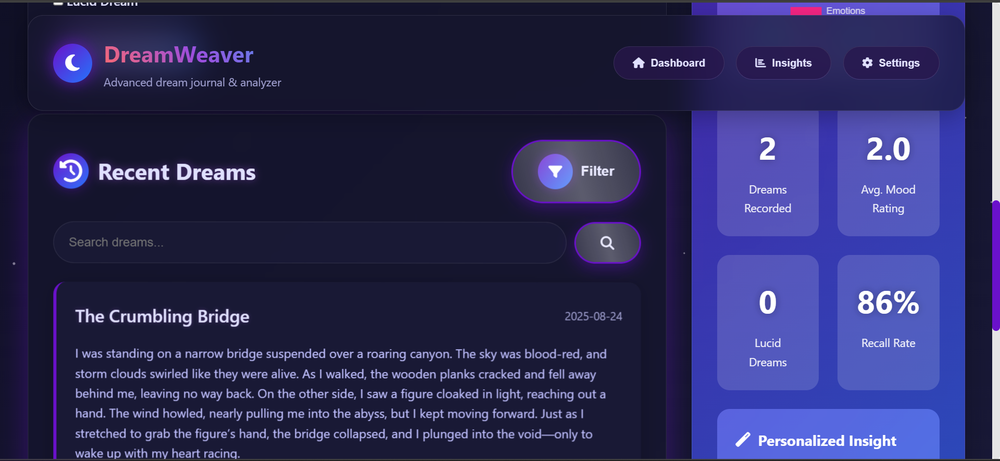

# 🌙 DreamWeaver | Futuristic Dream Journal

DreamWeaver is a modern and interactive **dream journaling web app** that allows you to record, organize, and analyze your dreams.  
It combines a sleek UI with **mood tracking, tagging, lucid dream logging, and data visualization** using Chart.js.  

---

## ✨ Features

📝 Record dreams with title, description, tags, and mood

🔖 Add custom tags for better dream categorization

🌗 Track lucid vs non-lucid dreams

📊 Visualize dream patterns with Chart.js insights

🔍 Search and filter dreams by mood, date, or theme

🎨 Futuristic UI with light/dark theme toggle

⚡ Smooth notification system for dream saving

✏️ Edit or delete dreams anytime

🧠 Dream analysis & insights for personal growth

---

## 🖥️ Tech Stack

- **HTML5, CSS3, JavaScript (Vanilla JS)**  
- **Font Awesome** for icons  
- **Chart.js** for interactive charts  

---

## 📸 Screenshots  

**Dashboard View**  
  

**Dream Entry Form**  
  

**Dream Analysis**
  

**Filter**
  

**Store Dream**
  

**Theme**
.png)  

🚧 Note: This is a demo idea for future development and not yet a complete product.
